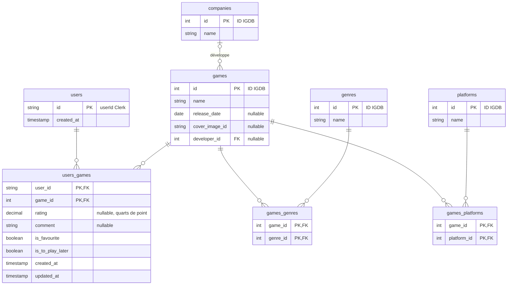

```mermaid
erDiagram
    users {
        string id PK "userId Clerk"
        timestamp created_at
    }

    users_games {
        string user_id PK, FK
        int game_id PK, FK
        decimal rating "nullable, quarts de point"
        string comment "nullable"
        boolean is_favourite
        boolean is_to_play_later
        timestamp created_at
        timestamp updated_at
    }

    games {
        int id PK "ID IGDB"
        string name
        date release_date "nullable"
        string cover_image_id "nullable"
        int developer_id FK "nullable"
    }

    genres {
        int id PK "ID IGDB"
        string name
    }

    games_genres {
        int game_id PK, FK
        int genre_id PK, FK
    }

    platforms {
        int id PK "ID IGDB"
        string name
    }

    games_platforms {
        int game_id PK, FK
        int platform_id PK, FK
    }

    companies {
        int id PK "ID IGDB"
        string name
    }

    users ||--o{ users_games : ""
    games ||--o{ users_games : ""
    games ||--o{ games_genres : ""
    genres ||--o{ games_genres : ""
    games ||--o{ games_platforms : ""
    platforms ||--o{ games_platforms : ""
    companies |o--o{ games : "développe"
```
